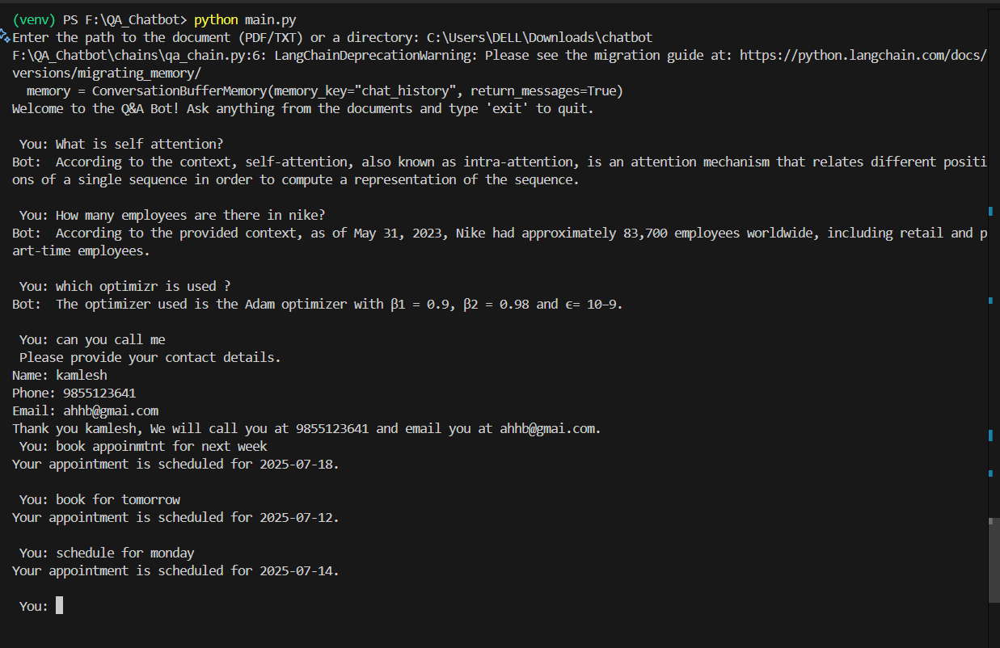

# QA_Chatbot

This project is a document-based chatbot built with LangChain. It answers user queries based on uploaded documents and detects conversational intent to handle contact, appointment booking, and question-answering. Tool Agents are used to collect and validate user input for contact and appointments.

## Features:

**Document Q&A**: Ask questions based on uploaded PDF/TXT documents.

**Intent Classification**: Classifies queries into:
    `qa`: document question
    `appointment`: book an appointment
    `contact`: share contact details
    
**Conversational Forms**:
    Collects `Name`, `Phone`, and `Email` if user wants to be contacted.
    Books appointments using natural language date input (e.g., "next Monday").

**Date Extraction with Tool Agent**:
    Extracts and returns date in YYYY-MM-DD format using regex + dateparser
    Handles fuzzy inputs like "tomorrow" or "next week"

**Input Validation**: Validates phone numbers and email addresses using regex tools.

## Tech Stack
LangChain
LLM: Groq with `llama3-8b-8192`
Embeddings: `all-MiniLM-L6-v2` via langchain_huggingface
Vector Store: FAISS
Date Parsing: dateparser
PDF Parsing: pypdf

## Requirements.txt
dotenv
langchain
langchain-huggingface
huggingface-hub
sentence-transformers
transformers
faiss-cpu
pypdf
dateparser

## Notes on Implementation
Only tool_agent.py was used to handle all validation and date extraction with @tool decorators.
Used ConversationBufferMemory (deprecated) for simplicity and compatibility with LangChain 0.1x.

## Installation
git clone `https://github.com/your-repo/QA_Chatbot.git` Install required Python packages using pip. `pip install -r requirements.txt` Use `.\venv\Scripts\activate` to activate virtual environment. This chatbot runs in the terminal. After setup: Run `python main.py` to run the chatbot.

## Sample Output

